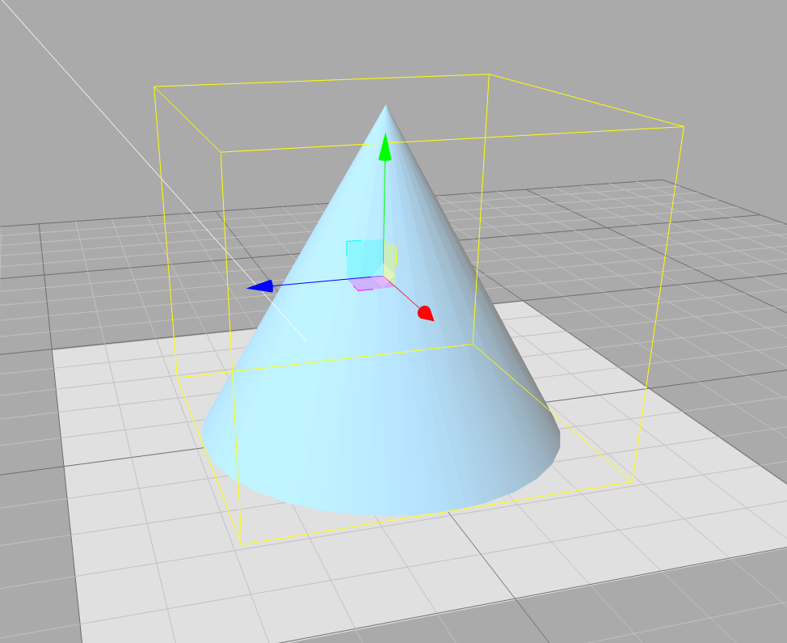

# ray-cone-intersection

The ray-cone intersection detect is widely used by ray-marching to draw 3d cone in shader program. But it also can be useful in 3d software development. So I turn the shader code into javascript.

`npm install ray-cone-intersection`

**Method**

-   `intersectCone(cone, ray) => null | {t : number, n : number[]|vec3}`

**Type**
```javascript
type Cone = {
    cosa:number,           // the half angle between the axis and the surface
    axis:vec3|number[],    // a unit vector ^V in the direction of **increasing** radius
    height:number,         // cone's height
    tipPos:vec3|number[],  // tip's position
}

type Ray = {
    origin:number[]|vec3,
    dir::number[]|vec3,
}
```


the cone at above can be represented as:
```javascript
const cone:Cone = {
    cosa: Math.cos(Math.PI / 6),
    axis: [0, -1, 0],
    height: 5,
    tipPos: [0, 5, 0],
}
```

**return value**

`{t:number, n:vec3} | null`

if there is no intersection, return null, otherwise, an object with the format as { t, n } will be returned. t is the scale factor of the ray, n is the normal vector of the intersected position on the cone.

**example**
```javascript
import {
    Cone,
    intersectCone,
} from 'ray-cone-intersection';
import { vec3 } from 'gl-matrix';

const cone:Cone = {
    cosa: Math.cos(Math.PI / 6),
    axis: [0, -1, 0],
    height: 5,
    tipPos: [0, 5, 0],
}

const ray = {
    origin: [10, 2.5, 0],
    dir: [-1, 0, 0],
};

const result = intersectCone(cone, ray);
if (result) {
    const hitPosition = vec3.scaleAndAdd(vec3.create(), ray.origin, ray.dir, result.t);
    const normal = result.n;
}
```
